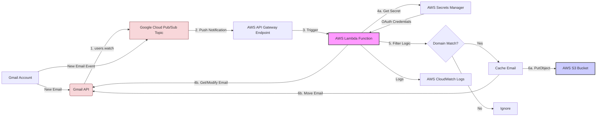

# Stop Gratuitous Email Messages  
## Identify Domain Email Source of Spam

### Workflow AWS services to filter Gmail emails 
### Identify sender domain patterns and cache for further analysis.

## **Core Idea:** We'll use Gmail's push notifications to trigger an AWS Lambda function 
### whenever a new email arrives. The Lambda function 
will examine the sender's domain, and if it matches specific patterns (like those seen in your examples), it will copy the email to an S3 bucket (cache) and then move it out of the Gmail inbox (e.g., to Trash or a specific label).

## **Diagrammatic Representation:**

***note:*** This workflow provides an automated way to isolate these specific types of emails for later investigation while keeping your main inbox cleaner. Remember to handle security (credentials) and the periodic nature of the `users.watch` renewal.

## **Components:**

1.  **Google Cloud Project & Pub/Sub:** Needed to enable Gmail API push notifications.
2.  **AWS API Gateway (or other endpoint):** To receive push notifications from Google Cloud Pub/Sub.
3.  **AWS Lambda Function:** The core processing logic resides here.
4.  **AWS S3 Bucket:** To cache the filtered emails.
5.  **AWS IAM Roles:** For granting necessary permissions to Lambda.
6.  **AWS Secrets Manager (Recommended):** To securely store Gmail API credentials (refresh token).
7.  **Gmail API:** To read and modify emails.

## **Workflow Steps:**

### **Phase 1: Setup (One-time Configuration)**

1.  **Google Cloud Setup:**
    *   Create a Google Cloud Project.
    *   Enable the **Gmail API** and **Google Cloud Pub/Sub API**.
    *   Create **OAuth 2.0 Credentials** (Client ID and Secret) for a Web Application or Desktop Application. You'll need to authorize this app to access your Gmail account (scopes: `https://www.googleapis.com/auth/gmail.modify` for reading and moving emails). Perform the OAuth flow once to get a **Refresh Token** for your Gmail account.
    *   Create a **Google Cloud Pub/Sub Topic** (e.g., `gmail-push-notifications`).
    *   Grant the Gmail API service account (`gmail-api-push@system.gserviceaccount.com`) permission to publish messages to this Pub/Sub topic.

2.  **AWS Setup:**
    *   Create an **S3 Bucket** (e.g., `my-gmail-filter-cache`) to store the filtered emails.
    *   Create an **IAM Role** for the Lambda function. This role needs permissions for:
        *   `logs:CreateLogGroup`, `logs:CreateLogStream`, `logs:PutLogEvents` (for logging).
        *   `s3:PutObject` (to write emails to the S3 bucket).
        *   `secretsmanager:GetSecretValue` (if using Secrets Manager for the refresh token).
        *   (Optionally) `apigateway:ManageConnections` if using WebSocket API Gateway, or relevant permissions if using HTTP API Gateway.
        *   (Optionally) `sns:Publish` if using SNS as an intermediary.
    *   (Recommended) Store the obtained Google OAuth **Refresh Token** and your **Client ID/Secret** securely in **AWS Secrets Manager**.
    *   Create the **AWS Lambda Function** (e.g., using Python 3.x):
        *   Assign the created IAM Role.
        *   Include necessary libraries (e.g., `google-auth`, `google-api-python-client`, `boto3`). You'll need to package these as a Lambda layer or include them in your deployment package.
        *   Configure environment variables (e.g., S3 bucket name, Secrets Manager secret ARN, desired Gmail label for filtered emails).
    *   Create an **API Gateway Endpoint** (HTTP API is simpler and cheaper) that triggers the Lambda function. Note the invocation URL.

3.  **Connecting Google to AWS:**
    *   Create a **Push Subscription** for your Google Cloud Pub/Sub Topic. Configure it to send notifications to the **HTTPS endpoint URL** of your AWS API Gateway.

4.  **Initiate Gmail Watch:**
    *   Run a script (can be a one-off local script or another Lambda) using the Gmail API's `users.watch` method. Provide:
        *   Your Gmail address (`userId`: 'me').
        *   The name of the Google Cloud Pub/Sub **Topic** created earlier.
        *   (Optional) Labels to watch (e.g., `INBOX`).
    *   This tells Gmail to send notifications to your Pub/Sub topic when changes occur (like new emails arriving in the INBOX). *Note: You need to renew this watch periodically (typically weekly).* A scheduled Lambda or CloudWatch Event could automate this renewal.

### **Phase 2: Runtime Workflow (Triggered by New Email)**

1.  **Email Arrival:** A new email arrives in your Gmail INBOX.
2.  **Gmail Notification:** Gmail detects the new email and publishes a notification message to your Google Cloud Pub/Sub topic.
3.  **Pub/Sub Push:** Google Cloud Pub/Sub pushes this notification message (which usually contains the user's email address and history ID) to your configured AWS API Gateway endpoint.
4.  **API Gateway Trigger:** API Gateway receives the request and triggers the associated AWS Lambda function, passing the notification payload.
5.  **Lambda Execution:**
    *   **Parse Notification:** The Lambda function parses the incoming payload from Pub/Sub via API Gateway. It might need to decode the base64-encoded data if Pub/Sub sends it that way. It extracts the user email and history ID. *Alternatively, instead of using history ID, the Lambda could just query for recent unread messages.*
    *   **Get Credentials:** Retrieve the OAuth 2.0 Client ID, Client Secret, and Refresh Token from AWS Secrets Manager (or environment variables, less secure).
    *   **Authenticate:** Use the credentials and refresh token to obtain a short-lived Access Token for the Gmail API.
    *   **Fetch Email(s):** Use the history ID (via `users.history.list`) or query recent messages (`users.messages.list` with `q='is:unread in:inbox'`) to get the ID(s) of new message(s). For each message ID:
        *   Fetch the full message details using `users.messages.get` with `format='metadata'` and `metadataHeaders=['From']` (or `format='full'` or `format='raw'` if needed later).
    *   **Filter Logic:**
        *   Extract the sender's email address from the `From` header.
        *   Parse the domain from the sender's email address.
        *   Define a list or regex pattern for the domains/subdomains to filter (e.g., `.*\.get-me-jobs\.com$`, `.*\.jobcase\.com$`, `.*\.jobhat\.com$`, `.*\.californiajobdepartment\.com$`, `updates@umail\..*`).
        *   Check if the extracted sender domain matches any of the filter patterns.
    *   **Action (If Match):**
        *   **Fetch Full Email:** If not already fetched, get the full raw email content using `users.messages.get` with `format='raw'`. Decode the base64url encoded string.
        *   **Cache to S3:** Upload the raw email content (e.g., as an `.eml` file) to the configured S3 bucket. Use the message ID as part of the object key for uniqueness (e.g., `filtered-emails/YYYY/MM/DD/{message-id}.eml`).
        *   **Move in Gmail:** Use `users.messages.modify` to:
            *   **Option A (Safer):** Add a specific label (e.g., `FilteredJobSpam`) and remove the `INBOX` label. This archives it under that label for review.
            *   **Option B (Direct Removal):** Move the email to Trash using `users.messages.trash`.
    *   **Action (No Match):** Do nothing. The email remains in the inbox.
    *   **Logging:** Log the decision (filtered/cached/moved or ignored) and the message ID to CloudWatch Logs.

### **Phase 3: Analysis (Manual/Separate Process)**

1.  Access the S3 bucket (`my-gmail-filter-cache`).
2.  Download or process the cached `.eml` files.
3.  Analyze the email headers (especially `Received`, `Return-Path`, `Sender`, `X-Originating-IP`, etc.) and content to understand the true source or purpose behind these emails sent via the filtered domains.
4.  Refine the filter patterns in the Lambda function based on your findings.

